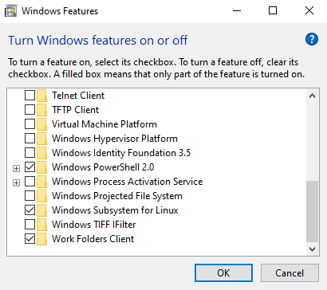

# Debian on WSL
Running Debian on WSL provides a native Debian Linux command-line environment directly on a Windows machine, allowing a user to use `apt` for packages and run standard Linux utilities without dual-booting.

Open Settings > Apps > Programs and Features > Turn Windows features on or off dialog and select the *Windows Subsystem for Linux* to enable WSL on your system. You may reboot your system.

After you have enabled WSL, you can install linux distribution via Microsoft Store. We will use the latest version of Debian linux for the hands-on lab. Open Microsoft Store app and search *Debian* (Debian 12, Bookworm), and install.

To verify your install, open windows terminal or command terminal and run `wsl -l -v` command to list WSL distributions. For more details about WSL command, please refer to [Basic commands for WSL](https://learn.microsoft.com/en-us/windows/wsl/basic-commands).

# Additional Resources

